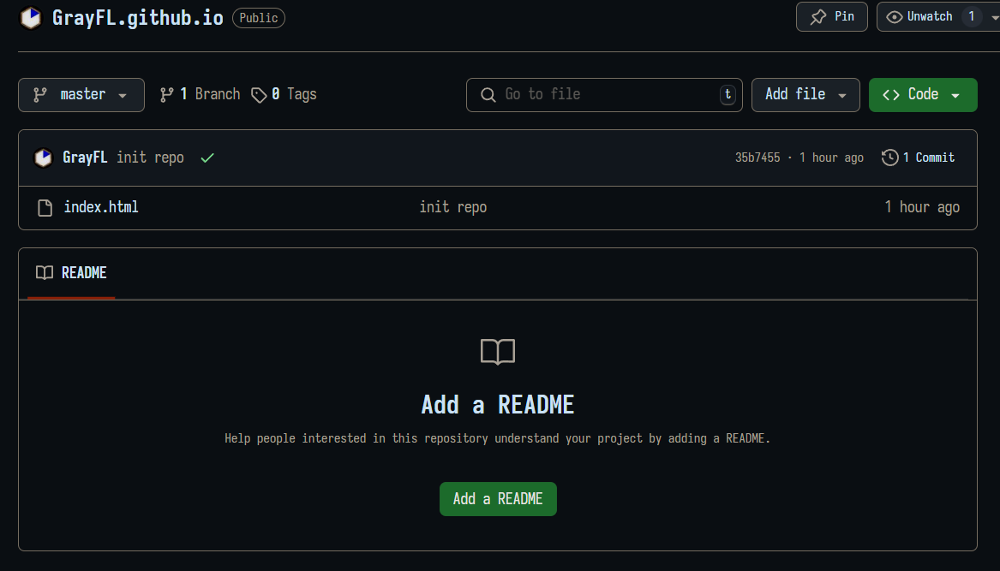

# 测试使用 Quarto 将 ``markdown`` 文档转换为 ``html`` 文档进行发布

$$
Taylor: f(x) = f(a) + f'(a)(x-a) + \frac{f''(a)}{2!}(x-a)^2 + \frac{f'''(a)}{3!}(x-a)^3 + \cdots
$$



列表：

- 项目一
- 项目二

代码块：

```python
print("Hello, World!")
```

<details>
    <summary> 测试折叠块 </summary>
    你觉得呢？
    - 这算是成功了吗？
</details>
